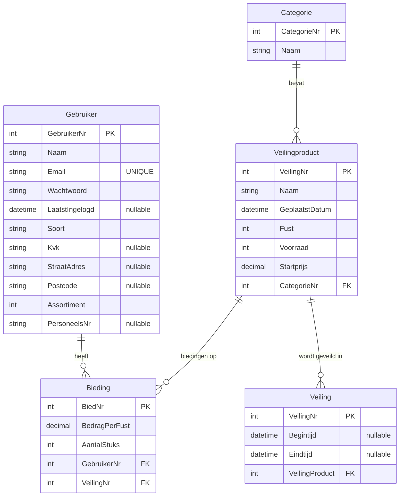

# Multilayer-Webapplications-Flower_Auction

This repo contains a small ASP.NET Core Web API for a flower auction domain.  
It includes **EF Core** models, controllers with **CRUD** endpoints, and seed data.

## Domain model (ERD)

> You can view the ERD below (Mermaid). A standalone diagram file is also included at `erd.mmd`.



### Cardinality & delete behavior

- **Gebruiker 1 — * Bieding** (FK: `Bieding.GebruikerNr`) — *Restrict* on delete.
- **Veilingproduct 1 — * Bieding** (FK: `Bieding.VeilingNr`) — *Cascade* on delete.
- **Categorie 1 — * Veilingproduct** (FK: `Veilingproduct.CategorieNr`) — *Restrict* on delete.
- **Veilingproduct 1 — * Veiling** (FK: `Veiling.VeilingProduct`) — *Cascade* on delete.

### Indexes

- `Gebruiker.Email` — **unique**
- `Veilingproduct (CategorieNr, Naam)` — non-unique composite index

---

## Tech stack

- **ASP.NET Core** Web API
- **Entity Framework Core** (code-first, migrations)
- **SQLite/SQL Server** compatible configuration
- Seed data for quick testing

## Running locally

1. Ensure the connection string is set in `appsettings.Development.json`.
2. Apply migrations:
   ```bash
   dotnet ef migrations add Init
   dotnet ef database update
   ```
3. Run the API:
   ```bash
   dotnet run
   ```
4. Open Swagger UI at the base URL (typically `https://localhost:5001/swagger`).

## API overview

### Bieding (`/api/Bieding`)
- `GET /api/Bieding` — list (filters: `gebruikerNr`, `veilingNr`, `page`, `pageSize`)
- `POST /api/Bieding` — create
- `PUT /api/Bieding/{id}` — update (amount & quantity)

### Categorie (`/api/Categorie`)
- `GET /api/Categorie` — list (search `q`, paging)
- `POST /api/Categorie` — create
- `PUT /api/Categorie/{id}` — update

### Gebruiker (`/api/Gebruiker`)
- `GET /api/Gebruiker` — list (search `q`, paging)
- `POST /api/Gebruiker` — create (requires `Wachtwoord`)
- `PUT /api/Gebruiker/{id}` — update

### Veiling (`/api/Veiling`)
- `GET /api/Veiling` — list (filters: `veilingProduct`, `from`, `to`, paging)
- `POST /api/Veiling` — create
- `PUT /api/Veiling/{id}` — update

### Veilingproduct (`/api/Veilingproduct`)
- `GET /api/Veilingproduct` — list (search `q`, `categorieNr`, paging)
- `POST /api/Veilingproduct` — create
- `PUT /api/Veilingproduct/{id}` — update

---

## Validation & precision

- Monetary fields use **decimal(18,2)** (`BedragPerFust`, `Startprijs`).
- DTOs contain `[Range]`, `[Required]`, `[MaxLength]` consistent with models.
- Controllers return consistent **ProblemDetails** payloads for errors.

## Notes

- `Veiling.Begintijd/Eindtijd` are **DateTime?**. Filters accept ISO8601 timestamps.
- Consider adding authentication/authorization for production use.

